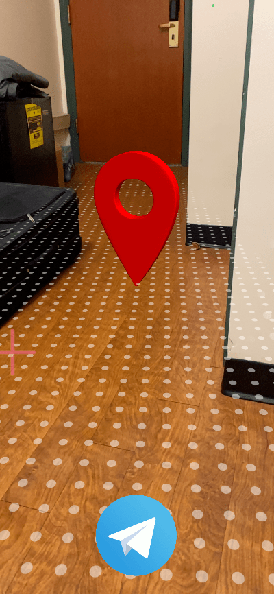

# Unity-ARFoundation-echo3D-demo-Pin-Location

Map pin location demo with Unity, ARFoundation, and echo3D.

## Register
If you don't have an echo3D API key yet, make sure to register for FREE at [echo3D](https://console.echo3D.co/#/auth/register).

## Setup
### Basics
* Clone [Unity-ARFoundation-echo3D-example](https://github.com/echo3Dco/Unity-ARFoundation-echo3D-example) repo and follow the instructions on [documentation page](https://docs.echo3D.co/unity/adding-ar-capabilities) to get your project up and running.

### PinLocation Package
* Clone this repo
* In your existing project of ```Unity-ARFoundation-echo3D```, from the toolbar on top select ```Assets > Import Package > Custom Package...```
* Select ```echo3D-PinLocation.unitypackage``` located in this repo and click ```Open```
* Click ```All``` and then ```Import```
* From the ```Project``` tab in Unity, go to ```Assets > AR Foundation > Scenes > PinLocation```
* Open the scene ```PinLocationAR```
* Edit ```ShareButtonHandler.cs``` file in the same directory
* Find the ```ShareLocation()``` function and place your API key and optional configurations
* From the project tab, go to ```Assets > AR Foundation > Scripts```
* Overwrite ```PlaceOnPlane.cs``` with the corresponding file in this repo

## echo3D Console
* In the ```Content``` page under Manage, select the option to upload new files
* Upload **both** files in the directory ```MapPinConsoleObject``` located in this repo

## Note
* This project utilizes [```Native Share for Android & iOS```](https://assetstore.unity.com/packages/tools/integration/native-share-for-android-ios-112731) from the Unity Asset Store
* In your Unity project, go to ```Asset Store``` and download the asset above in its entirety

## Run
* Save, build and run the project just as you would for [Unity-ARFoundation-echo3D](https://docs.echo3D.cO/unity/adding-ar-capabilities)

Note: These instructions assume that you are familiar with building and running the project for your desired platform (iOS, Android...) Please consult external resources if you are having difficulties in this process.

* In Build Settings, after selecting iOS, ensure that you have selected the correct scene that is ```AR Foundation/Scenes/PinLocation/PinLocationAR```. If this option is not available, click ```Add Open Scenes``` and try again by looking at the end of the list.

## Usage
When share button at the bottom-center of the screen is touched, user location is determined with [LocationService](https://docs.unity3d.com/ScriptReference/LocationService.html) in Unity. The location is sent within an HTTP POST request to echo3D’s API.
* In the [echo3D console](https://console.echo3D.co/#/pages/data), go to ```Data``` tab under Manage
* The ```location``` should be seen in the ```Global database``` table on this page

## Screenshots
### Pin


### Share


## Attributions
* "Map Pin" (https://skfb.ly/6SVFx) by Ilyas.King is licensed under Creative Commons Attribution (http://creativecommons.org/licenses/by/4.0/).

## Support
Feel free to reach out at [support@echo3D.co](mail:support@echo3D.co) or join our [support channel on Slack](https://go.echo3D.co/join)
